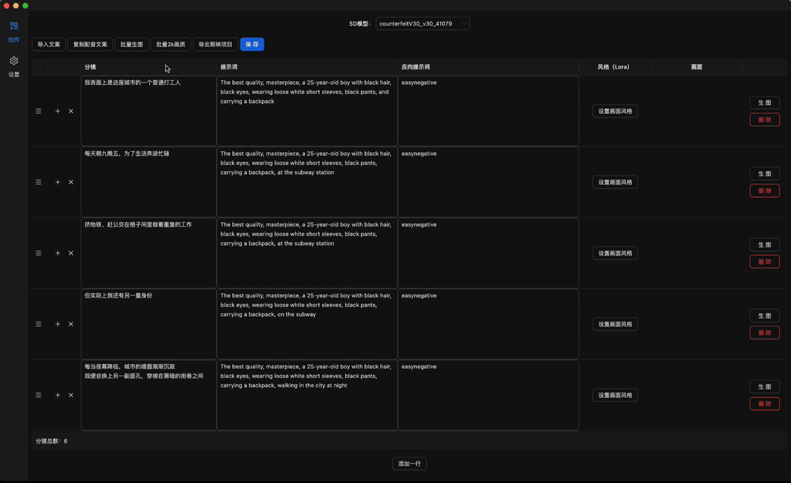

## 介绍

1、界面  



2、生成的视频效果


## 环境要求
需要nodejs 18.17.0 以上版本

## 如何启动
### 1、安装nvm 
安装地址：https://github.com/nvm-sh/nvm  
  
   
配置完成后不要忘记执行一下source命令  

### 2、安装ffmepg
推荐使用homebrew安装
``` 
 brew install ffmpeg
```
homebrew需要配置镜像源的环境变量，否则很慢

https://mirrors.tuna.tsinghua.edu.cn/help/homebrew/

### 3、启动  
> 注意：依赖python 2
```
cd diffusion-capcut-video
npm install 

cd release/app  
npm install  

cd ../../
npm start 
```
